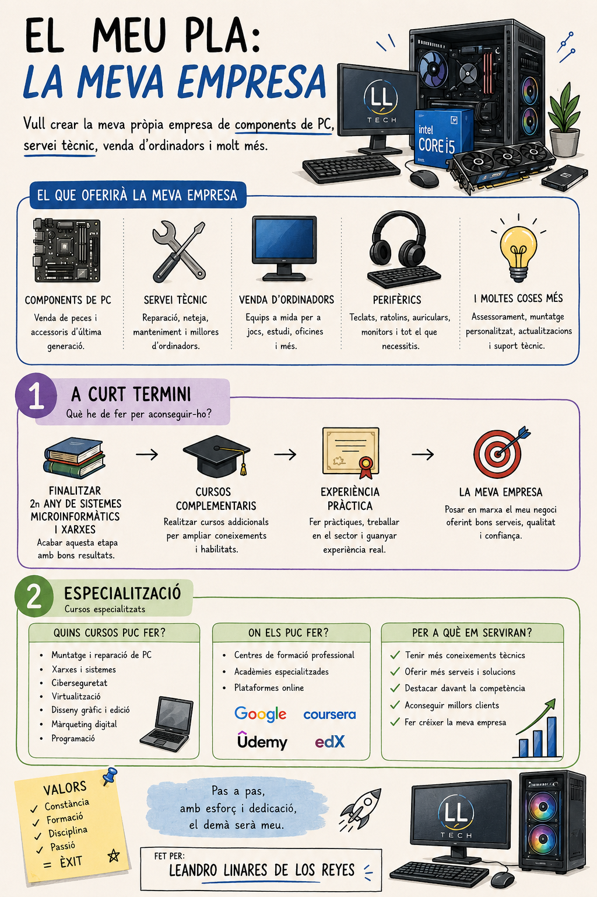

# 🎓 Presentació Final - Leandro Linares de los Reyes

---

# 📋 Què veureu en aquesta presentació?

- Presentació del meu GitHub
- Repositoris del meu segon any
- Estructura de les carpetes
- Tasques i projectes destacats
- Reflexió final sobre aquests dos cursos

---

# 👨‍💻 Presentació personal: Qui és en Leandro?

Hola! Em dic **Leandro Linares de los Reyes** i actualment estic cursant el segon any del cicle de **Sistemes Microinformàtics i Xarxes**.

El que més m'agrada és el **muntatge, manteniment i reparació d'equips informàtics**. M'interessa treballar amb el maquinari, diagnosticar problemes i trobar solucions perquè els equips funcionin correctament.

Em considero una persona **sociable, responsable i amb facilitat per treballar en equip**. M'agrada col·laborar amb els altres, compartir coneixements i ajudar sempre que puc. També intento mantenir una actitud positiva davant dels reptes i continuar aprenent per millorar tant personalment com professionalment.

---

# 🚀 Què vull fer en el meu futur?

De cara al futur, m'agradaria crear la meva pròpia empresa dedicada a la venda de dispositius electrònics, semblant a **PcComponentes**, però amb un valor afegit important: disposar també d'un servei tècnic de reparació i manteniment.

La meva idea és oferir un espai on la gent no només pugui comprar tecnologia, sinó també comptar amb un suport tècnic proper, ràpid i de qualitat quan ho necessiti.

---

# 📚 Què m'emporto d'aquests dos cursos?

D'aquests dos cursos m'emporto molts coneixements nous, noves amistats i experiències que recordaré.

He après a treballar de diferents maneres, tant individualment com en equip, i he realitzat treballs pràctics i teòrics que m'han ajudat a millorar les meves habilitats. També he après a ser més responsable, organitzat i constant.

Tot això m'ha ajudat a créixer tant personalment com acadèmicament i a tenir més clar el que vull fer en el meu futur.

---

# ⭐ Tasques que més m'han agradat

## 🎨 Disseny d'una pàgina web amb Figma

Una de les activitats que més em va agradar va ser treballar amb **Figma**, ja que em va permetre dissenyar una pàgina web de vapejadors de manera creativa i visual, aprenent conceptes de disseny, estructura i organització de continguts.

🔗 **Projecte Figma:**

[Veure projecte](https://www.figma.com/design/UohcJxnvaqlyK4Hf3S4JsZ/Sin-t%C3%ADtulo?node-id=0-1&p=f&t=YuRHE3i5Svks84G4-0)

---

## 🤖 Creació d'una web sobre sostenibilitat amb IA

Una altra activitat que em va agradar molt va ser la creació d'una pàgina web sobre la sostenibilitat amb l'ajuda de la intel·ligència artificial.

Aquesta activitat em va permetre aprendre noves eines digitals, investigar sobre un tema important i combinar creativitat i tecnologia per desenvolupar un projecte interessant.

🔗 **Projecte web:**

[Veure pàgina web](https://leandroreyess.github.io/Foodlogistic-Leandro/#)

---

# 🙌 Gràcies per la vostra atenció
